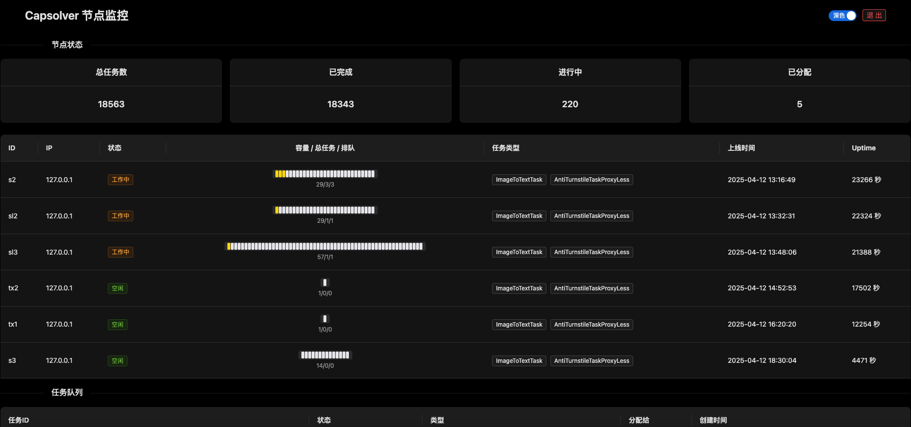

# brush-captcha - 自建打码平台

本项目基于 Camoufox 指纹伪装方案，包含前端页面、后端 API 服务和分布式打码客户端，支持多实例并发运行。目前仅支持了Turnstile，后续根据实际项目需要将继续集成其他类型打码。

---

### 📦 版本记录（Release History）

| 版本号    | 日期         | 更新内容简述                                                                                                                    | 备注                         |
| ------ | ---------- | ------------------------------------------------------------------------------------------------------------------------- | -------------------------- |
| v1.1.0 | 2025-04-18 | 1、使用静态代理打码，由server端统一调度；<br>2、增加server端鉴权，防止端口滥用；<br>3、增加hcaptcha支持，目前仅集成gemini打码方案；<br>4、修复Turnstile打码性能问题；<br>5、优化任务调度； | 关键功能升级                     |
| v1.0.0 | -          | 🎉 首个正式版本发布                                                                                                               | 初始稳定版本，仅支持Turnstile和动态ip打码 |

---

### ✅ 验证码支持一览表

| 验证码类型           | 是否支持    | 备注说明                                                                                                                              |
| --------------- | ------- | --------------------------------------------------------------------------------------------------------------------------------- |
| `Turnstile`     | ✅ 支持    | -                                                                                                                                 |
| `hCaptcha`      | ✅ 支持    | 集成[QIN2DIM/hcaptcha-challenger](https://github.com/QIN2DIM/hcaptcha-challenger?tab=readme-ov-file)方案，需要Gemini API KEY,目前存在性能问题，慎用 |
| `ReCaptchaV2`   | 🚧 计划支持 | 当前仅支持 Turnstile 类型验证码                                                                                                             |
| `ReCaptchaV3`   | 🚧 计划支持 | 需模拟用户行为，目前未集成                                                                                                                     |
| `FunCaptcha`    | ❌ 不支持   | 结构复杂，暂不支持                                                                                                                         |
| `Geetest`       | ❌ 不支持   | 无交互组件模拟逻辑                                                                                                                         |
| `ImageToText`   | ❌ 不支持   | 本项目不处理纯打码图片                                                                                                                       |
| `RotateCaptcha` | ❌ 不支持   | 需模拟旋转交互，暂不支持                                                                                                                      |
| `SlideCaptcha`  | ❌ 不支持   | 缺乏滑动行为模拟                                                                                                                          |

---

## 📦 项目结构

```
.
├── backend/       # server端，提供鉴权、任务提交、结果查询、WS 任务分发
├── frontend/      # React + Ant Design 前端界面，展示任务状态、节点情况
├── client/        # 基于 Camoufox 的自动化打码客户端（支持多线程+代理）
├── docker-compose.yml
└── README.md
```

---

## 🧠 效果图



---

### 🚀 开箱即用

#### 🔧 环境准备

- Python 3.11+
- Node.js 20+
- [Docker](https://www.docker.com/) & [Docker Compose](https://docs.docker.com/compose/)
- Nginx（建议部署ssl。注意：不配置ssl无法兼容小刷子打码）
- Gemini API key    (需要图像识别的项目专用)

---

#### server端和前端页面安装

```bash
git clone https://github.com/Brush-Bot/brush-captcha.git
cd brush-captcha
```

```
将以下配置文件放到tmp文件夹：

# proxies.txt
代理ip文件，必须配置，一行一条ip，支持http://user:pass@ip:port、user:pass@ip:port、ip:port:user:pass格式

# nginx.conf.template / nginx.ssl.template
nginx配置，不知道怎么配置的默认即可

# *.crt / *.key / *.pem
ssl证书，兼容多种格式，一键脚本可以识别，需要配置ssl的一定要提前把证书放进去
新手可以使用以下指令自签：
openssl req -x509 -newkey rsa:2048 -nodes \
  -keyout server.key \
  -out server.crt \
  -days 365 \
  -subj "/C=CN/ST=Beijing/L=Beijing/O=MyCompany/OU=Dev/CN=localhost"
  
# user_keys.txt
允许连接用户key列表，一条一个（这里建议直接存放gemini的api key，方便需要gemini的项目传入key）

```

```bash
bash install_server_and_frontend.sh
```

#### client端安装

```bash
cd client
nano config.yaml
```

修改config.yaml

```config.yaml
# 并发数设置（可选，不填则自动根据系统资源计算）
concurrency: null

# Camoufox 参数配置
camoufox:
  solver_type:    # 当前设备支持的打码类型，支持的类型server端才会分配任务
    - HcaptchaCracker
    - AntiTurnstileTaskProxyLess
  headless: "true"    # 无头模式，默认打开即可

worker:
  name: "test"    # 当前设备名称
  wss_url: "ws://127.0.0.1:8080/ws/worker/"    # 后端api地址，替换ip和port即可
                                            # 如果配置了ssl，协议头改成wss
```

保存文件，开始构建

```bash
docker compose up -d
```

注意：
1、client的基础镜像比较大，请耐心等待，并保持网络环境稳定
2、请确保运行client端机器能够连接上你的代理ip（科学上网）,建议设置：

```angular2html
IP-CIDR,45.38.0.0/16,proxy,no-resolve
```

```
默认监控页面地址：http://{ip}:8080/
账号：admin
密码：admin
```

### ## 🛠 手动启动

### 🔹 Backend - 后端服务

```bash
cd backend
python -m venv .venv && source .venv/bin/activate
pip install -r requirements.txt
uvicorn main:app --host 0.0.0.0 --port 8000
```

或构建 Docker 镜像运行：

```bash
docker build -t brush-backend ./backend
docker run -d -p 8000:8000 brush-backend
```

---

### 🔹 Frontend - 监控前端

先设置 src/api.js 中的 BASE 值

```bash
cd frontend
npm install
npm run build
# 本地预览
npm install -g serve
serve -s dist -l 3000
```

建议通过nginx反代，未验证brush直接使用http是否可行

---

### 🔹 Client - 分布式打码节点

参考client目录中config.yaml修改对应参数

```bash
cd client
python -m venv .venv && source .venv/bin/activate
pip install -r requirements.txt
python run_client.py  # 或通过 Docker 启动分布式 worker
```

---

## 📄 示例 Nginx 配置

```nginx
server {
    listen 8998 ssl;
    server_name yourdomain;

    ssl_certificate yourpath;
    ssl_certificate_key yourpath;

    location / {
        root /home/ubuntu/capsolver_server_dashboard/build;
        index index.html;
        try_files $uri /index.html;
    }

    location /api/ {
        proxy_pass http://127.0.0.1:8000/;
        proxy_http_version 1.1;
        proxy_set_header Host $host;
        proxy_set_header X-Real-IP $remote_addr;
    }
    location /ws/ {
        proxy_pass http://127.0.0.1:8000/;
        proxy_http_version 1.1;
        proxy_set_header Upgrade $http_upgrade;
        proxy_set_header Connection "upgrade";
    }
}
```

---

## 📦 后续计划

- [ ] 多类型验证码支持（Google, hCaptcha）
- [ ] 节点优先级调度策略

---

## 💬 联系与支持

如果你有任何建议或问题，欢迎提交 [Issues](https://github.com/0xC0FFEE42/brush-captcha/issues) 或 PR！

---
